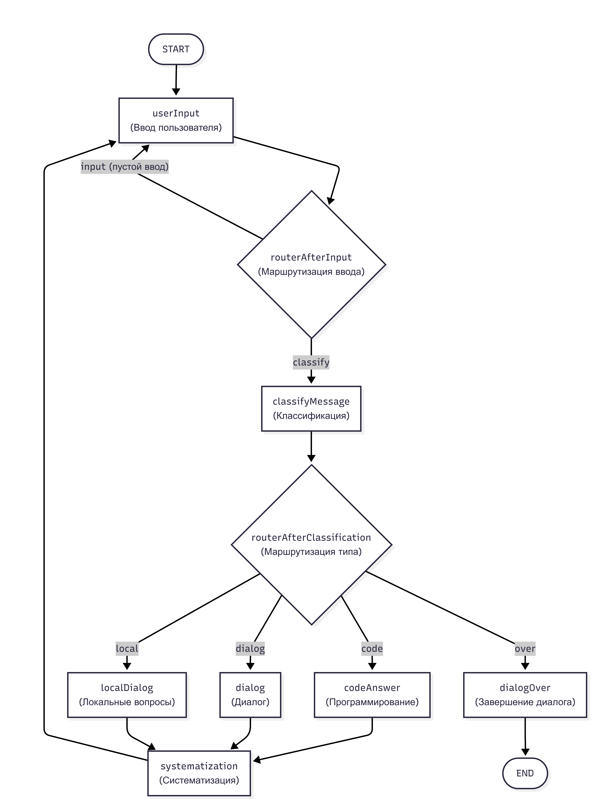
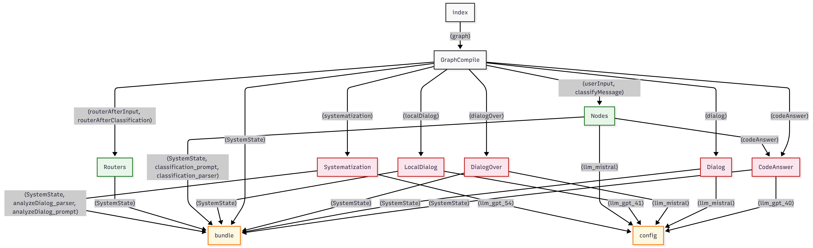
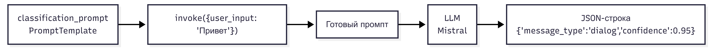
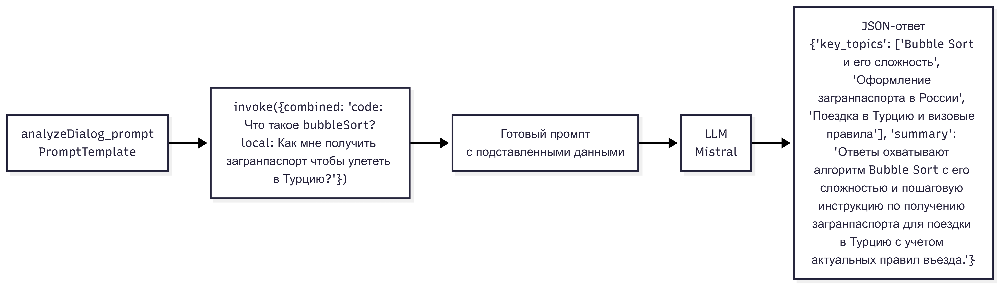

<font size="3"><b>

<div align = 'center'>


# Multimodel

### Описание работы


Multimodel представляет собой граф, который использует 4 разных LLM в зависимости от типа сообщения.

`
Ввод пользователя -> определение типа сообщения -> вызов соответствующей LLM -> Вывод LLM -> систематизация полученных результатов -> вывод систематизирующей LLM -> Ввод пользователя
`

#### <a name="message-types"></a> Типы сообщений
<div align = 'left'>

1) CODE: сообщение содержит вопрос или сообщение, связанное с программированием 
   
   (Отвечает gpt-4o-mini)
2) LOCAL: вопрос или сообщение связано с внутренней системой Российской Федерации, включая вопросы о получении различных выписок или документов

(Отвеает gpt-4.1-mini)

3) OVER: сообщение, содержание которого говорит о смысловом завершении диалога, то есть пользователь явно хочет завершить диалог, прощаясь и благодаря ии за предоставленные ответы
   
(Отвечает Ollama-mistral)

4) DIALOG: ведение обычного диалога, то есть те сообщения, которые по смыслу не подходят ко всем вывшеперечисленным типам
   
(Отвечает также Ollama-mistral)
</div>

#### Архитектура проекта
<div align = 'left'>
Архитектура проекта представляет собой гибридную систему, сочетающую в себе графовую маршрутизацию (LangGraph) и модельную агрегацию.


</div>

#### Пояснение
<div align = 'left'>
<span style="color: green;">Зеленый цвет - узлы графа (прямоугльники на диаграмме)</span>

<span style="color: pink;">Розовый цвет - функция-роутер (ромбы на диаграмме)</span>

1)  <span style="color: green;">**userInput**</span> - функция ввода сообщения пользователя
   
      Возвращаемые данные  
         
- messages: List[BaseMessage] - История диалога + новое сообщение пользователя
- current_message: str - Текст, который ввел пользователь

```python
def userInput(state: SystemState)->dict:
    user_input = input("Вы: ").strip()
    if not user_input:
        print("Спросите что-нибудь")
        return {}
    new_messages = state["messages"]+ [HumanMessage(content = user_input)]
    return {
        "messages": new_messages,
        "current_message": user_input,
    }
```


2) <span style="color: pink;">**routerAfterInput**</span> - маршрутизатор ввода userInput

      Возвращаемые данные   
         
- input - еще раз идем в узел userInput, так как ввод пустой
- classify - переходим в узел классификации сообщений classifyMessages

```python
def routerAfterInput(state: SystemState)->str:
    current_message = state["current_message"]
    if not current_message:
         return "input"
    else:
         return "classify"
```

3) <span style="color: green;">**classifyMessage**</span> - классификация сообщений через LCEL с использование Pydantic для структурированного вызова: [calss ClassifyMessage(BaseModel)](#cl-me)

      Возвращаемые данные   
- message_type: str - [Типы сообщений](#message-types)

   Вывод:
- message_type - тип сообщения
- confidence - уверенность в решении


```python
def classifyMessage(state: SystemState)-> dict:
    user_input = state["current_message"]
    classification_chain = classification_prompt | llm_mistral | classification_parser
    classification_result = classification_chain.invoke({"user_input": user_input})

    message_type = classification_result["message_type"]
    confidence = classification_result["confidence"]

    print(f"Тип сообщения: {message_type}, уверенность: {confidence}")
    return{
        "message_type": message_type,
    }
```

4) <span style="color: pink;">**routerAfterClassification**</span> - маршрутизатор для вызова нужной LLM

   [Возвращаемые данные](#message-types)   
  - code -> codeAnswer()
   - local -> localDialog()
   - over -> dialogOver()
   - dialog -> dialog()

```python
def routerAfterClassification(state: SystemState)-> str:
    message_type = state["message_type"]
    if message_type == "code":
        return "code"
    elif message_type == "local":
        return "local"
    elif message_type == "over":
        return "over"
    return "dialog"
```

5.1. <span style="color: green;">**codeAnswer**</span> - узел обработки кода с помощью gpt-4o-mini

   Возвращаемые данные  
   - messages: List[BaseMessage]
   - code: str - последний ответ LLM по коду


```python
def codeAnswer(state: SystemState)->dict:
    user_input = state["current_message"]
    messages = [SystemMessage(content="Ты - программист с огромным стажем, дай краткий и информативный ответ")] + state["messages"]
    response = llm_gpt_40.invoke(messages)
    result = response.content
    print(f"ИИ(gpt_40): {result}")
    new_messages = state["messages"]+ [AIMessage(content = result)]
    return {
        "messages": new_messages,
        "code": result
    }
```

5.2. <span style="color: green;">**localDialog**</span> - узел обработки вопроса об РФ с помощью gpt-4.1-mini

   Возвращаемые данные  
   - messages: List[BaseMessage]
   - local: str - последний ответ LLM по диалогу


```python
def localDialog(state: SystemState)->dict:
    user_input = state["current_message"]
    messages = [SystemMessage(content="Дай краткий и инофрмативный ответ по Российсикм реалиям")]+ state["messages"]
    response = llm_gpt_41.invoke(messages)
    result = response.content
    print(f"ИИ(gpt_41): {result}")
    new_messages = state["messages"]+ [AIMessage(content = result)]
    return {
        "messages": new_messages,
        "local": result
    }
```
5.3. <span style="color: green;">**dialogOver**</span> - узел обработки прощания с пользователем с помощью mistral

   Возвращаемые данные: Отсутствуют


```python
def dialogOver(state: SystemState)->None:
    user_input = state["current_message"]
    messages = [SystemMessage(content="Лаконично попращяйся, пожелай успехов в задачах пользователя")]+ state["messages"]
    response = llm_mistral.invoke(messages)
    result = response.content
    print(f"ИИ(gpt_41): {result}")
    new_messages = state["messages"]+ [AIMessage(content = result)]

```
5.4. <span style="color: green;">**dialog**</span> - узел обработки ведения диалога с помощью mistral

   Возвращаемые данные  
   - messages: List[BaseMessage]
   - local: str - последний ответ LLM по диалогу


```python
def localDialog(state: SystemState)->dict:
    user_input = state["current_message"]
    messages = [SystemMessage(content="Дай краткий и инофрмативный ответ по Российсикм реалиям")]+ state["messages"]
    response = llm_gpt_41.invoke(messages)
    result = response.content
    print(f"ИИ(gpt_41): {result}")
    new_messages = state["messages"]+ [AIMessage(content = result)]
    return {
        "messages": new_messages,
        "local": result
    }
```

6) <span style="color: green;">**systematization**</span> - узел систематизации полученных ответов через LCEL с использование Pydantic для структурированного вызова от gpt-5.4-mini: [calss AnalyzeDialog(BaseModel)](#an-di)

   Возвращаемые данные: Отсутствуют

   Вывод:
- key_topics - ключевые темы
- summary - краткая аннотация

```python
def systematization(state: SystemState)->None:
    code = state.get("code", "")
    local = state.get("local", "")
    dialog = state.get("dialog", "")

    combined = ""
    if code:
        combined += f"Программирование: {code}\n"
    if local:
        combined += f"Локальные реалии: {local}\n"
    if dialog:
        combined += f"Общий диалог: {dialog}\n"

    if not combined:
        print("Нет данных для систематизации")


    analyzeDialog_chain = analyzeDialog_prompt | llm_gpt_54 | analyzeDialog_parser
    analyzeDialog_result = analyzeDialog_chain.invoke({"combined": combined})

    key_topics = analyzeDialog_result["key_topics"]
    summary = analyzeDialog_result["summary"]
    print(f"ИИ(gpt_51): Ключевые темы:{key_topics}\n Резюме: {summary}")
```
</div>

___

## Структура проекта
<div align = 'left'>

Используемые файлы:
  - CodeAnswer.py: файл с инициализацией узла с  LLM для ответа на вопросы по коду 
  
  - Dialog.py: файл с инициализацией узла с LLM для поддержания диалога
  - LocalDialog.py: файл с инициализацией узла с LLM для ответа на вопросы по РФ
  - DialogOver.py: файл с логическим завершением диалога
  - GraphCompile.py: файл со сборкой графа
  - Nodes.py: файл с инициализаций 
  - Routers.py: файл с маршрутизаторами 
  - Systematization.py: файл с систематизацией полученных ответов от LLM
  - bundle.py: файл с инициализацией системного состояния, pydantic-моделей и формированием промтов и прасинга json
  - config.py: файл конфигурации с инициализацией llm-моделей
  - index.py: main-функция, компиляция всего приложения
  - requirements.txt: необходимые для установки зависимости 
</div>

#### Диаграмма модулей + импортируемые поля


___

## Системное состояние
<div align = 'left'>

Определяемые состояния:
- current_message: str - последнее отправленное пользователем сообщение

- messages: List[BaseMessage] - история диалога
- message_type: str - тип отпраляемого текущего сообщения
- code: str - последний ответ от LLM codeAnswer
- local: str - последний ответ от LLM localDialog
- dialog: str - последний ответ от LLM dialog

```python
class SystemState(TypedDict):
    current_message: str
    messages: List[BaseMessage]
    message_type: str
    should_continue: bool
    code: str
    local: str
    dialog: str
```
</div>

___

## Pydantic-модели, промпты и парсеры

###  <a name="me-cl"></a> MessageClassify - pydantic-модель
</div>

<div align = 'left'>

**Назначение**: Описывает, как должен выглядеть JSON-ответ от LLM при классификации сообщений

**Поля**: 
 - message_type - [Типы сообщений](#message-types)
 - confidence - Уверенность в решении от 0.0 до 1.0

```python
class MessageClassify(BaseModel):
    message_type: Literal["code", "dialog", "local", "over"] = Field(
        description = "Тип сообщения: code - программирование, dialog - общение, local - российские реалии, over - завершение диалога"
    )
    confidence: float = Field(
        description = "Уверенность в классификации от 0.0 До 1.0",
        ge = 0.0, le = 1.0
    )
```
<div align = 'center'>

<div align = 'center'>__</div>

#### Промпт и парсер
</div>

<div align = 'left'>

Парсер, который преобразует JSON-ответ от LLM в структурированный объект и валидует его по полям MessageClassify

```python
classification_parser = JsonOutputParser(pydantic_object = MessageClassify)
```
<div align = 'center'>__</div>

Шаблон промта для LLM для классификаций сообщений пользователя: использует PromptTemplate для динамической подстановки данных

```python
classification_prompt = PromptTemplate(template = """Определи тип сообщения пользователя:
    CODE - сообщение про программирование, отладку, код, алгоритмы, технологии
    DIALOG - обычное сообщение, просьбы о помощи, общение, объяснения
    LOCAL - сообщение про Россию, российские законы, локальные особенности, госуслуги, вопросы по формлению каких-то документов(например: загранпаспорт или получение выписки по счету)
    OVER - пользователь прощается, явно говрит пока, до скидания, благодарит за предоставленные ответы (например: Спасибо за информативный диалог, было приятно пообщаться!)

    Сообщение: {user_input}

    {format_instructions}

    Верни ТОЛЬКО JSON!
""",
    input_variables = ["user_input"],
    partial_variables={"format_instructions": classification_parser.get_format_instructions()}
)
```
<div align = 'center'>
__

LCEL - схема
</div>
<p>Приведен пример работы chain когда пользователь пишет "Привет"</p>

<div align = 'center'> 



</div>

<div align = 'center'>

___

### <a name="an-di"></a> Типы сообщений AnalyzeDialog - pydantic-модель

</div>

<div align = 'left'>

**Назначение**: Описывает, как должен выглядеть JSON-ответ от LLM при определении ключевых тем диалога и как должена выглядеть краткая аннотация по нему

**Поля**: 
 - key_topics - Ключевые темы диалога
 - summary - Краткое резюме в одном предложении

```python
class AnalyzeDialog(BaseModel):

    key_topics: List[str] = Field(
        description="Ключевые темы диалога"
    )
    summary: str = Field(
        description="Краткое резюме в одном предложении",
        max_length=150
    )
```

</div>
<div align = 'center'>

#### Промпт и парсер

</div>

<div align = 'left'>

Парсер, который преобразует JSON-ответ от LLM в структурированный объект и валидует его по полям AnalyzeDialog

```python
analyzeDialog_parser = JsonOutputParser(pydantic_object = AnalyzeDialog)
```
<div align = 'center'>__</div>

Шаблон промта для LLM для анализа данных LLM ответов: использует PromptTemplate для динамической подстановки данных

```python
analyzeDialog_prompt = PromptTemplate(template = """
   Проанализируй данные ответы:

   {combined}

   Выдели ключевые темы и дай краткое резюме в одном предложении.

   {format_instructions}

   Верни ТОЛЬКО JSON!
   """,
   input_variables = ["combined"],
   partial_variables={"format_instructions": analyzeDialog_parser.   get_format_instructions()}
)
```

<div align = 'center'>
__

LCEL - схема
</div>
<p>Приведен пример работы chain когда пользователь спросил: "Что такое bubbleSort?" и "Как мне получить загранпаспорт чтобы улететь в Турцию?"</p>

<div align = 'center'> 



</div>


</div>


</div>


####


</b></font>
